# Requerimientos:

1 - descargar las maquinas virtuales donde acceseremos y usaremos como filtro,
    en el siguiente enlace estaran las maquinas ya configuradas:
    https://www.whonix.org/wiki/VirtualBox

para la descarga deberas darle en el boton como lo muestra en la siguinete imagen, tambien puedes comprobar la firmaa digital para que compruebe s que no se trata de archivios modificados o algo de fishing:

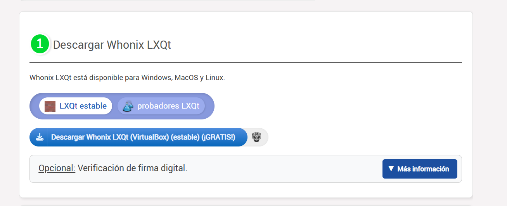

le das en el boton de Descargar Whonix LXQt

---

2 - Para una mayor seguridad descarga una VPN aunque gratuita es bastante buena y funcional en el siguiente enlace:

https://protonvpn.com/download?srsltid=AfmBOorm5PQKeYXGpwNcFOSBRyFMVHH3bMiprU7GGXFEPbYEeDv9-gkE

Para descargar, necesitas una cuenta con un correo electronico, por lo que te recomiendo que generes un correo electronico nuevo para no tener vulnerabilidades.

Una vez descargada la VPN la abrimos y hacemos la siguiente configuracion 

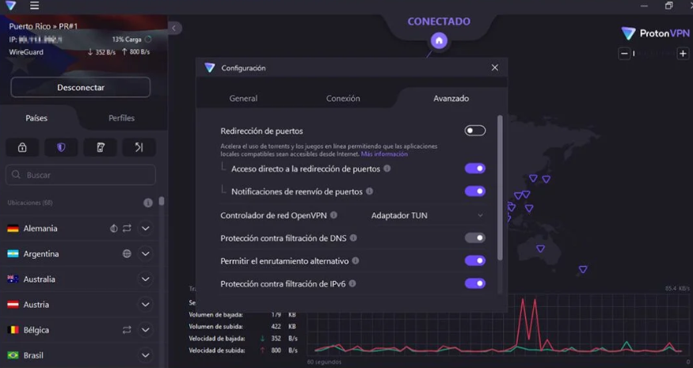

Luego de ello nos diponemos a importar el entorno de tranajo en las maquinas virtuales para esta ocacion usaremos virtualbox importaremos de la siguiente manera:

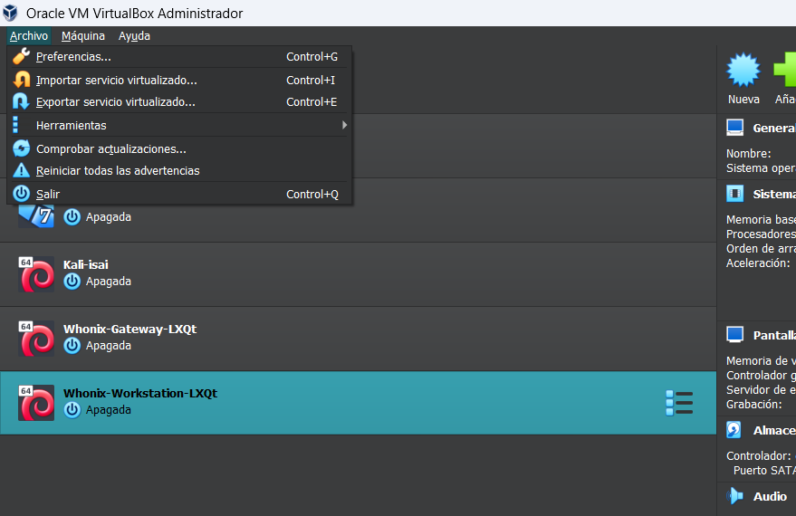

Como se muestra en la imagen vamos al panel superior izquierdo en el apartado de ARCHIVO una ves ahi se desplegara un menu con distintas opciones donde daremos clic a la opcion de importar servicio virtualizado, se nos desplegara una ventana como la siguiente:

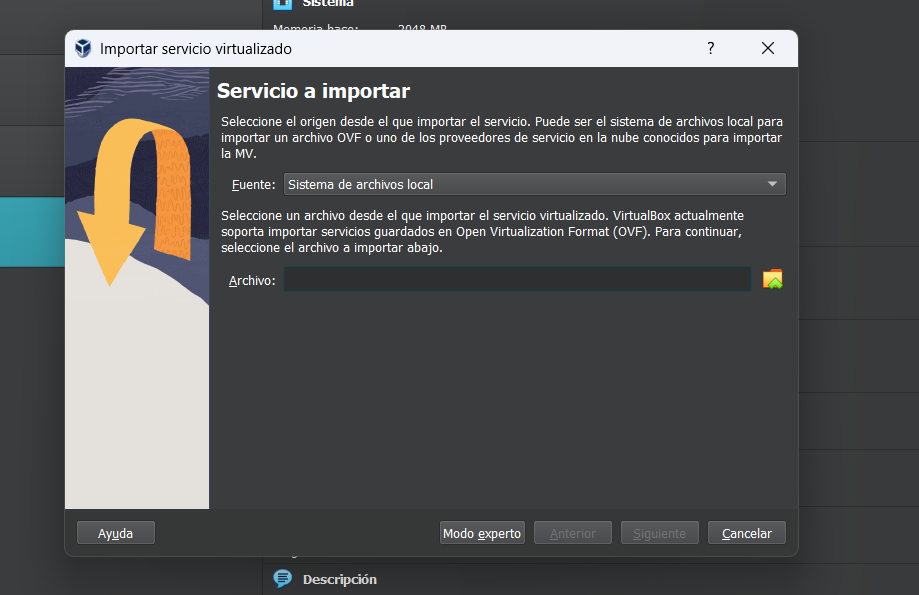

una vez hecho esto le damos en siguiente icono:

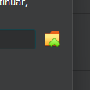

dento de ahi buscaremos nuestro archivo que descargamos en el paso 1, Whonix y lo seleccionamos y se nos epezara a importar las maquinas, esto demorara un par de minutos, luego de ellos y que finalice la importacion nos apareceran las siguientes maquinas:

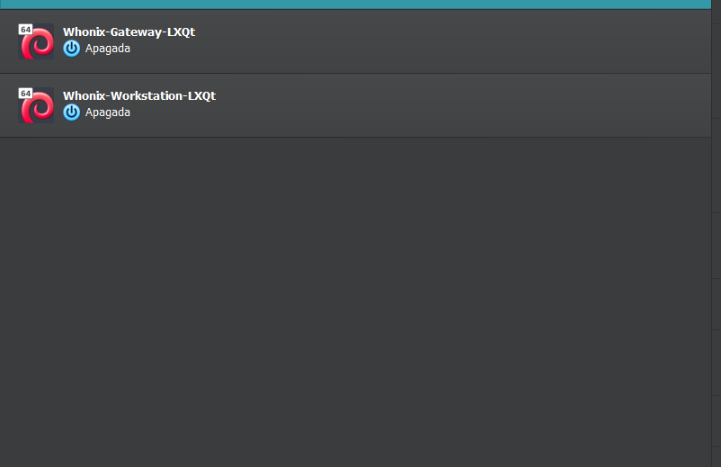

Eso es todo por la importacion de nuestro entorno de trabajo el siguiente paso sera entrar a la deep web.

---

.

# PASOS PARA ENTRAR A LA DEEB WEB DE MANERA SEGURA

1 - Como recomendacion personal si es que decidiste instalar la VPN haremos lo siguiente, abriremos la aplicacion y le daremos en conectar, esto nos conectara a un servidor de otro pais que a su vez enmascarara mnuestra ip real.

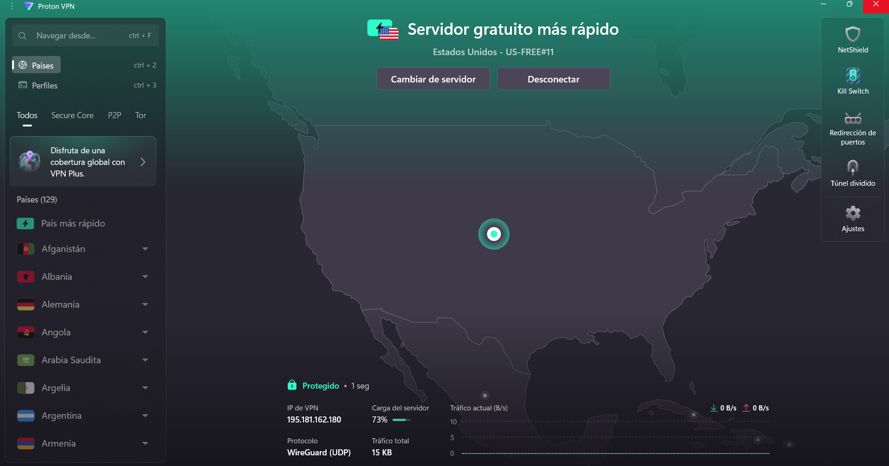

Luego de ello volvemos a virtualbox  y encenderemos la siguiente maquina virtual:

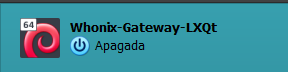

Una vez encendida, esperaremos a que arranque y a todas las ventanas emergentes le daremos OK una vez que este en el escitorio sin ventanas emergentes procedemos a minimizar esta maquina, ojo es minimizar no apagar, una vez minimizada, arrancamos la siguiente maquina virtual:

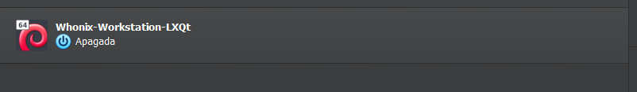

Lo mismo esperaremos a que arranque y daremos todo en OK hasta estar en el escritorio sin ventanas emergentes, le daremos en el icono de la carita con lentes y el sombrero esta en la esquina superior izquierda

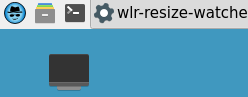

Luego de ello teclearemos Tor:

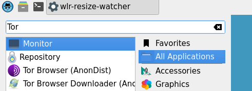

Y daremos clic en el siguiente TOR

Una vez entro de tor, no maxiimices la pantalla de el navegador dejalo asi en pequeño, ya  que esto evita que nos puedan rastrear por tamaño de pantalla. 

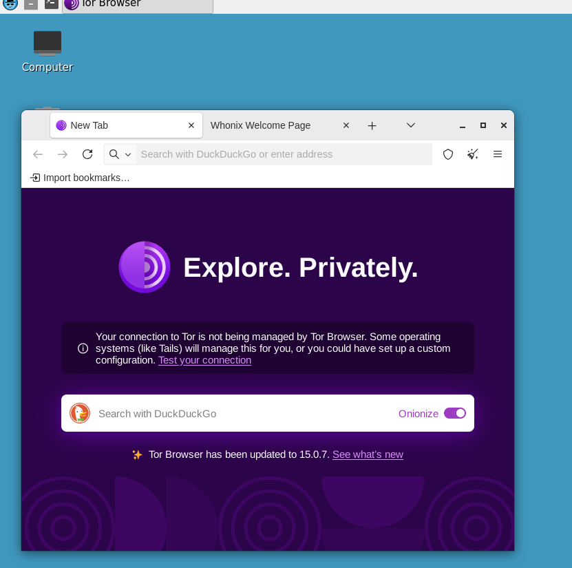

Una vez dentro en la parte de direccion, no en la parte de el recuadro blanco si no arriba en la barra de direccion escribiremos el siguiente link sin nada de errors de letras ni simbolos 

http://juhanurmihxlp77nkq76byazcldy2hlmovfu2epvl5ankdibsot4csyd.onion/

Si te daz suenta ya no son links .com si no .onion y sirve como prueba de que ya estas dentro de la depp web, pero que es este link, bueno es un buscador de la deep web o dark web, este buscador es especial por que entre sus busquedas flitra solo contenido legal, y evita darte resultados ilegales, una ves dentro, puedes buscar lo que quieras foros pero recuerda hacerlo en ingles por que la mayoria de la web se encuentra en este idioma y listo eso es todo, ya estas navegando en la deep web, solo procura no comprar y ten cuidado en los links que abres, la mayoria de lo que encontraras ya sea de venta de productos o servicios es FISHING . 

Para apagar y dejar odo como antes para luego usarlas despues es de manera inversa, cierra el navegador, apaga la maquina virtual, (Worksapce) una vez apagada esta maquina procedemos a entrar a la Gateway y la apagaremos luego de ello puedes cerrar virtualbox y luego ya apagar la VPN si lo deseas de esta manera aseguramos una enrada limpia y sin tantos riesgos a la deep web, esta es una de las maneras mas seguras de entrar sin embargo es responsabilidad de cada uno asumir las consecuencias de lo que te puedas encontrar ahi dentro como caer en esrafas etc. 

# Funcionamiento de las maquinas 

Whonix funciona con dos máquinas virtuales separadas para aumentar el anonimato.

La primera es la Gateway. Esta máquina es la única que tiene salida real a internet. Su función es ejecutar el servicio Tor y obligar a que todo el tráfico pase por esa red. Configura reglas de firewall para bloquear cualquier conexión que no vaya a través de Tor. No navegas desde aquí. Solo actúa como intermediaria.

La segunda es la Workstation. Esta es la máquina que tú usas para navegar, investigar o acceder a sitios .onion. Pero no tiene acceso directo a internet. Solo puede comunicarse con la Gateway a través de una red interna virtual. Eso significa que aunque algo en la Workstation intente conectarse directamente afuera, no puede hacerlo porque no tiene ruta directa.

El flujo real es así: la Workstation envía el tráfico a la Gateway, la Gateway lo envía a la red Tor, y desde Tor sale hacia el destino final.

La razón de dividirlo en dos máquinas es reducir riesgos. Si la Workstation se ve comprometida por malware o una vulnerabilidad del navegador, el atacante no puede ver tu IP real porque esa información nunca está en la Workstation. Solo la Gateway conoce la salida hacia Tor.

Sobre la llamada deep web, técnicamente lo correcto sería hablar de la dark web cuando se trata de sitios .onion. La deep web en general es simplemente contenido no indexado por buscadores. Whonix está diseñado para acceder a servicios ocultos de Tor de forma más segura que usar solo un navegador Tor en tu sistema principal.

Ahora sobre la VPN. No es obligatoria para que Whonix funcione. Sin VPN, tu proveedor de internet puede ver que estás usando la red Tor, pero no puede ver qué estás haciendo dentro de ella.

Si usas una VPN antes de Tor, tu proveedor solo verá que te conectas a una VPN. Luego el tráfico va de la VPN a Tor. Esto oculta el uso de Tor frente al ISP, pero introduces un nuevo punto de confianza: el proveedor VPN. Si la VPN guarda registros o está mal configurada, puede afectar tu anonimato.

La arquitectura de Whonix ya está pensada para que el tráfico no se filtre fuera de Tor. La VPN es una capa adicional, no un requisito técnico.

Lo más importante es entender que Whonix protege el anonimato a nivel de red. No protege contra errores del usuario, descargas inseguras o revelar información personal en un sitio. El anonimato depende tanto de la arquitectura como del comportamiento.

autopsy
ftkmager
forencis
kainelinux
caine
volatily
try hack

