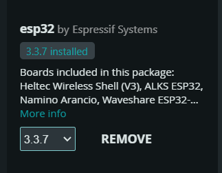
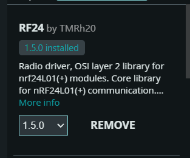
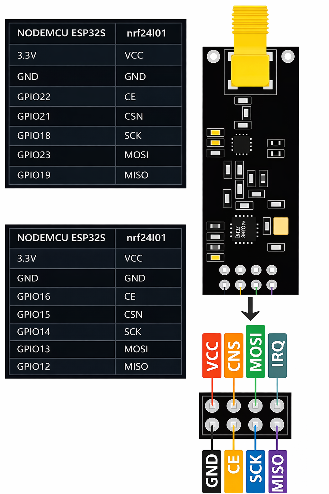

# Indicaciones :

## Material:

1 - ESP32 (no importa el modelo.)
2 - 2 modulos NRF24
3 - Entorno Arduino IDE

## Proceso: 

Tienes que descargar arduino IDE para progrsmar el esp32 donde en el gestor de placas deberas instalar la siguiente:



Luego de ello en la seccion de librerias instalaraas la siguiente: 




Una vez terminado la instalacion procede a pegar el siguiente codigo:

```bash
#include <RF24.h>
#include <esp_bt.h>
#include <esp_wifi.h>
#include <esp_bt_main.h>

SPIClass *sp = nullptr;
SPIClass *hp = nullptr;

RF24 radioA(16, 15, 19909090);
RF24 radioB(22, 21, 19909090);

int HSPIchannel = 45;
int VSPIchannel = 45;
unsigned int HSPIflag = 0;
unsigned int VSPIflag = 0;

void channelSweeper() {
  if (VSPIflag == 0) VSPIchannel += 4; else VSPIchannel -= 4;
  if (HSPIflag == 0) HSPIchannel += 2; else HSPIchannel -= 2;
  if ((VSPIchannel > 79) && (VSPIflag == 0)) VSPIflag = 1; else if ((VSPIchannel < 2) && (VSPIflag == 1)) VSPIflag = 0;
  if ((HSPIchannel > 79) && (HSPIflag == 0)) HSPIflag = 1; else if ((HSPIchannel < 2) && (HSPIflag == 1)) HSPIflag = 0;
  radioA.setChannel(HSPIchannel);
  radioB.setChannel(VSPIchannel);
}

void randomChannel() {
  radioA.setChannel(random(80));
  radioB.setChannel(random(80));
  delayMicroseconds(random(60));
}

void initHSPI() {
  hp = new SPIClass(HSPI);
  hp->begin();
  if (radioA.begin(hp)) {
    radioA.setAutoAck(false);
    radioA.stopListening();
    radioA.setRetries(0, 0);
    radioA.setPayloadSize(32);
    radioA.setAddressWidth(5);
    radioA.setPALevel(RF24_PA_MAX, true);
    radioA.setDataRate(RF24_2MBPS);
    radioA.setCRCLength(RF24_CRC_DISABLED);
    radioA.startConstCarrier(RF24_PA_MAX, HSPIchannel);
  }
}

void initVSPI() {
  sp = new SPIClass(VSPI);
  sp->begin();
  if (radioB.begin(sp)) {
    radioB.setAutoAck(false);
    radioB.stopListening();
    radioB.setRetries(0, 0);
    radioB.setPayloadSize(32);
    radioB.setAddressWidth(5);
    radioB.setPALevel(RF24_PA_MAX, true);
    radioB.setDataRate(RF24_2MBPS);
    radioB.setCRCLength(RF24_CRC_DISABLED);
    radioB.startConstCarrier(RF24_PA_MAX, VSPIchannel);
  }
}

void setup() {
  esp_bt_controller_deinit();
  esp_wifi_stop();
  esp_wifi_deinit();
  esp_wifi_disconnect();
  if (esp_bluedroid_get_status() == ESP_BLUEDROID_STATUS_ENABLED) {
    esp_bluedroid_deinit();
    esp_bluedroid_disable();
  }
  initHSPI();
  initVSPI();
}

void loop() {
  channelSweeper();
  randomChannel();

}

```
Teniendo esto procedemos a armar el circuito como lo puedes ver en la siguiente diagrama:



Asegurate de la conexion sea a 3.3V ya que si se pasa de este voltaje quemaras los chips de el nrf24, no es necesario apretar el boton de boot en el esp32 ya que el codigo ya le indica que haga su reinicio, lo unico que tienes que hacer es conectar ya con los modulos ensablados y listo.

## Aviso Importante

Este proyecto tiene únicamente fines educativos y de investigación académica.  
Su propósito es analizar el funcionamiento de las redes inalámbricas en la banda de 2.4 GHz, comprender conceptos de interferencia, comunicación por radiofrecuencia y vulnerabilidades en entornos controlados.

No se promueve ni se respalda el uso indebido de la información aquí presentada.  
Cualquier aplicación fuera de un laboratorio o entorno autorizado puede ser ilegal y es responsabilidad exclusiva de quien la realice.

El autor no se hace responsable por el uso inapropiado, ilícito o no autorizado del contenido de este repositorio.